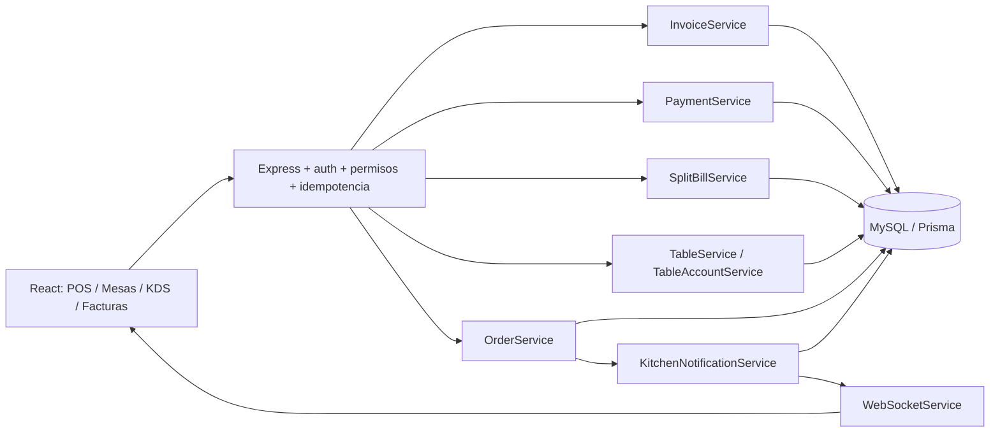
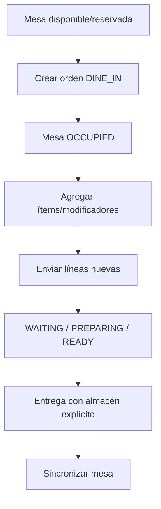
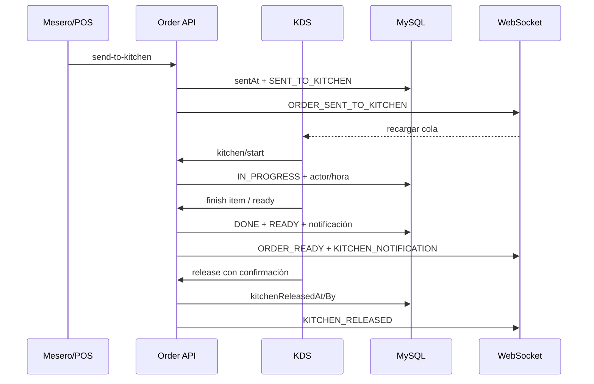
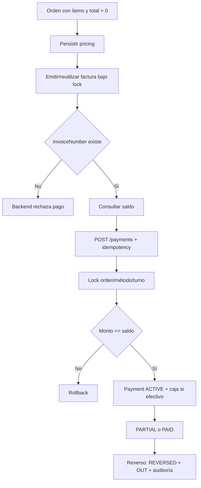
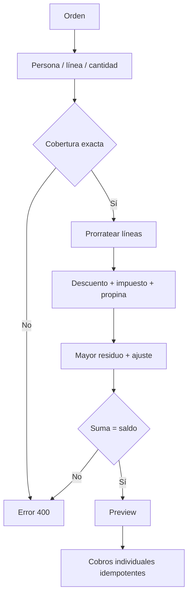
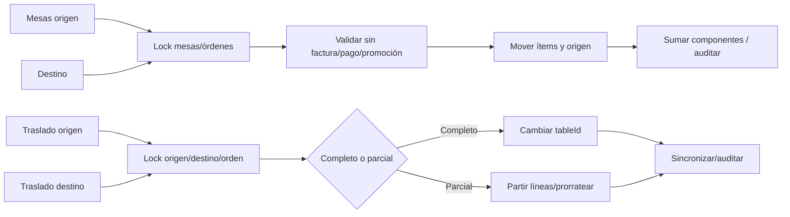
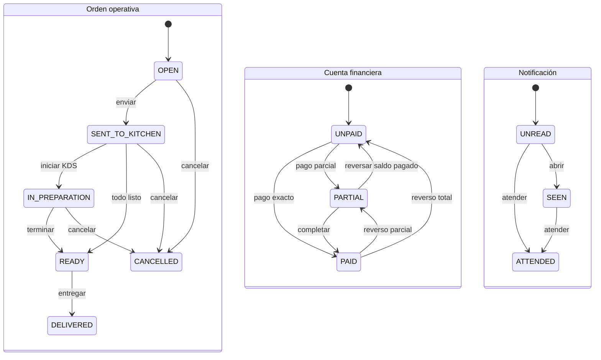

# Mesas, órdenes, facturación, pagos y KDS

Estado documentado: 14 de julio de 2026. Este documento describe exclusivamente el código presente en el árbol de trabajo de `C:\restaurant` en esa fecha. No certifica despliegue ni migración en producción.

## Revisión UX y plano persistente — 14 de julio de 2026

La gestión de mesas ahora funciona como centro operativo inmersivo. La ruta `/tables` ocupa toda la ventana, conserva el acceso contextual a pedido, órdenes, factura y cobro, e incorpora un editor persistente por sucursal. La entrada POS independiente fue retirada de la navegación y `/pos` redirige al centro de mesas; el componente POS sigue reutilizándose internamente con la mesa seleccionada.

El plano dejó de inferir zonas efímeras desde `Table.location`. La arquitectura nueva incorpora:

- `TableFloorPlan`: tamaño de lienzo y versión optimista única por sucursal.
- `FloorArea`: salones, terrazas, barras y áreas privadas con nombre, color, posición, tamaño, rotación y forma.
- `Table.floorAreaId`: asignación explícita y opcional de cada mesa a un área.
- `PUT /api/tables/plan/:branchId`: guardado transaccional de lienzo, áreas y geometría de mesas, con CAS por versión, auditoría y actualización WebSocket.
- `GET /api/tables/plan/:branchId`: snapshot canónico completo para recarga y recuperación después de guardar.

El editor permite mover y redimensionar salones y mesas, cambiar mesas entre forma rectangular, cuadrada y redonda, rotarlas y modificar las formas del área (`RECTANGLE`, `ROUNDED`, `OVAL`, `L_SHAPE`). Al salir con cambios sin guardar se solicita confirmación, y una recarga accidental activa la protección `beforeunload`.

Procesar Pago fue simplificado: se eliminó `split-financial-summary`; la estrategia “Por platos” se renombró “Por unidades”; las asignaciones comienzan en cero y se conservan al cambiar el número de comensales; cada unidad se distribuye con controles −/+, mostrando progreso explícito. El modo dividido usa un ancho mayor y superficies basadas en tokens de tema.

Cocina ahora ofrece dos experiencias con la misma lógica y permisos: `/kitchen` para supervisión PC y `/kds` como tablero táctil inmersivo. El tablero KDS no muestra navegación lateral, puede entrar en Fullscreen API, expone productos directamente en cada tarjeta y muestra errores de carga en lugar de confundir un 403/500 con una cola vacía. Los roles de cliente se alinearon con backend: MESERO observa el estado desde Mesas, pero no entra al KDS sin permiso.

Migración: `20260714_add_floor_areas`. Rollback: elimina primero la relación de `Table`, luego `FloorArea` y `TableFloorPlan`.

Convenciones: **Implementado** existe en código; **Parcial** existe una parte pero falta alcance o validación end-to-end; **Pendiente** no existe un flujo seguro.

## 1. Resumen ejecutivo de la implementación

Se separó el estado operativo de la orden de su estado financiero, se hizo obligatoria la factura antes del cobro, se endureció el pago con bloqueos e idempotencia, se añadió reversión auditable y se estabilizó el modal. La división por consumo calcula cantidades enteras de una línea y reconcilia descuentos, impuestos, propina y redondeos en centavos.

También se incorporaron un plano persistente de mesas, traslado total/parcial, consolidación atómica, trazabilidad de origen, estados operativos derivados, KDS táctil con inicio/listo/liberación persistentes y notificaciones WebSocket al mesero. Las rutas críticas usan permisos nominales con roles de compatibilidad.

El alcance no está completamente cerrado: los cobros divididos son secuenciales y la asignación no se persiste como entidad histórica; no existen anulación de factura, reversión de consolidación ni entidad persistente de comensal/división. Véase la sección 30.

## 2. Problemas originales identificados

- El monto recibido mezclaba conversión numérica y presentación durante la edición.
- La previsualización de división dependía de estado que ella misma reemplazaba, causando renderizados/peticiones repetidos.
- Los selectores de método dentro del scroll podían quedar recortados.
- La semántica fiscal estaba invertida: el cobro no exigía factura y la factura se orientaba a órdenes pagadas.
- Se infería efectivo desde el nombre visible del método.
- Mesas era un catálogo sin geometría ni consolidación/traslado transaccional.
- La cola KDS reutilizaba órdenes activas y no tenía liberación durable.
- No existía notificación persistente/deduplicada al mesero.
- Las rutas operativas dependían de roles amplios sin catálogo nominal completo.

## 3. Causas raíz

1. `PaymentModal` reconstruía `splits`; la identidad de callbacks/arrays cambiaba y volvía a disparar el preview.
2. El valor editable era tratado como número, no como texto transitorio validable.
3. El selector no usaba la variante modal que portaliza el menú.
4. `Order.status` mezclaba operación y cobro; ahora existe `OrderFinancialStatus` independiente.
5. El comportamiento de caja dependía de `PaymentMethod.name`; ahora usa `type` y snapshot `Payment.methodType`.
6. Consolidación/traslado necesitaban locks ordenados, recálculo por componentes y auditoría en una transacción.
7. KDS carecía de un ciclo durable; se añadieron timestamps y actores.
8. Las notificaciones carecían de identidad de evento; una clave única por ciclo evita duplicados.

## 4. Arquitectura anterior

- React/Vite consumía Express/Prisma.
- `Table` tenía número, capacidad, ubicación y estado físico, pero no plano.
- `Order.status` gobernaba cocina; no existían inicio/liberación KDS persistentes.
- `PaymentService` cobraba sin exigir `invoiceNumber`; `InvoiceService` dependía del cobro.
- `SplitBillService` repartía equitativamente, por línea completa o monto, sin cantidades parciales.
- KDS observaba órdenes activas/WebSocket, sin cola separada ni avisos persistentes.
- La autorización operacional se expresaba principalmente como roles.

## 5. Arquitectura final

- `InvoiceService` emite antes del pago y protege orden/secuencia con `FOR UPDATE`.
- `PaymentService` valida factura, saldo y método en transacción; compara centavos y conserva actor, tipo e idempotencia.
- `SplitBillService` calcula sin persistir; `PaymentService` sigue siendo autoridad de cobro.
- `TableAccountService` concentra plano, consolidación y traslado con bloqueos/auditoría.
- `TableService` deriva estado visual desde mesa, órdenes, ítems, factura y finanzas.
- `OrderService` conserva la máquina operativa y ciclo KDS. La cola excluye órdenes liberadas sin borrarlas.
- `KitchenNotificationService` persiste/deduplica avisos y emite WebSocket dirigido.
- `requirePermission` aplica permisos nominales con fallback de roles.

## 6. Componentes modificados

- `client/src/components/PaymentModal.tsx` / `.css`: edición monetaria, resumen, división, portal, reintento, tema y responsive.
- `client/src/pages/POS.tsx`: persiste pricing, emite factura y luego abre pago.
- `client/src/pages/InvoiceHistory.tsx` / `.css`: facturas emitidas no pagadas, historial y reverso.
- `client/src/pages/Tables.tsx` / `.css`: catálogo/plano, layout, traslado y consolidación.
- `client/src/pages/Kitchen.tsx` / `.css`: cola/historial, controles táctiles, temporización y WebSocket.
- `client/src/components/Layout.tsx`: campana KDS.
- `client/src/services/api.ts`, tipos, autorización y WebSocket.
- Backend: controladores, rutas, validadores, Prisma, seeds y servicios siguientes.

## 7. Componentes creados

- `TableMap.tsx/.css`: plano, zoom, pan, drag, colisiones, leyenda y modos.
- `TableOperationModal.tsx/.css`: traslado completo/parcial y consolidación.
- `KitchenNotificationBell.tsx/.css`: avisos no leídos/vistos/atendidos.
- `kdsTiming.ts` e `idempotency.ts`.
- `table-account.service.ts` y `kitchen-notification.service.ts`.
- Controlador y rutas de notificaciones KDS.

## 8. Servicios modificados

| Servicio | Cambio verificable |
|---|---|
| `PaymentService` | Factura obligatoria, locks, centavos, idempotencia, snapshot de tipo, saldo, reverso y contramovimiento. |
| `InvoiceService` | Emisión previa, validación no vacía, secuencia bloqueada e `invoicedAt`. |
| `SplitBillService` | Cantidades, cobertura exacta, mayor residuo y saldo tras pagos parciales. |
| `TableService` | Estados válidos, lock al editar y estado operacional derivado. |
| `OrderService` | Ciclo KDS, timestamps/actores, cola e historial. |
| `SettingService` | Umbrales KDS por empresa. |
| `WebSocketService` | `KITCHEN_NOTIFICATION` y eventos KDS. |

## 9. Endpoints creados o modificados

Todos viven bajo `/api`, requieren autenticación y conservan tenant; los controladores aplican sucursal cuando corresponde.

| Método y ruta | Permiso / alcance | Función |
|---|---|---|
| `GET /orders/kitchen/config` | `kds.view` | Umbrales/reloj. |
| `GET /orders/kitchen/queue` | `kds.view` | Cola no liberada. |
| `GET /orders/kitchen/history` | `kds.view` | Historial. |
| `POST /orders/:id/kitchen/start` | `kds.manage` | Inicia preparación. |
| `POST /orders/:id/kitchen/ready` | `kds.manage` | Marca lista. |
| `POST /orders/:id/kitchen/release` | `kds.manage` | Libera sin borrar. |
| `PATCH /orders/:id/items/:itemId/start|finish` | `kds.manage` | Ciclo de ítem. |
| `GET /kitchen-notifications` | destinatario autenticado | Lista avisos propios. |
| `PATCH /kitchen-notifications/:id/seen|attended` | destinatario | Cambia estado. |
| `PUT /tables/layout` | `tables.map.edit` | Layout versionado. |
| `POST /tables/consolidate` | `tables.consolidate` | Consolida cuentas. |
| `POST /tables/transfer` | `tables.transfer` | Traslada orden/cantidades. |
| CRUD `/tables` | permisos `tables.*` | Gestión de mesas. |
| `POST /split-bill/:orderId/evenly|by-items|by-amount` | `bills.split` | Previews/validación. |
| `GET /invoices/:id` y `/pdf` | `invoices.issue` | Emite/reutiliza y lee/PDF. |
| `POST /payments` | `payments.process` | Cobro facturado. |
| `GET /payments/order/:orderId[/summary]` | `payments.process` + roles lectura | Historial/saldo. |
| `DELETE /payments/:id` | `payments.reverse` | Reverso con motivo. |

Órdenes cambió a `orders.view/create/edit/cancel/deliver`. No hay endpoint de anulación fiscal.

## 10. Tablas y relaciones afectadas

- `Table`: coordenadas, tamaño, forma, rotación, versión y fecha de layout.
- `Order`: `financialStatus`, `invoicedAt`, inicio/liberación KDS y `consolidatedIntoOrderId`.
- `OrderItem`: `originOrderId`, `originTableId`.
- `PaymentMethod.type`; `Payment.methodType`, idempotencia, actores, estado/reverso y `payerName`.
- `KitchenNotification`: tenant, orden, destinatario, tipo, dedup, estado, payload y timestamps.
- `Setting`, `Permission`, `_PermissionToRole` y `AuditLog`.

Los IDs de procedencia son escalares, no relaciones con cascada, para preservar registros cancelados.

## 11. Migraciones

1. `20260714_harden_financial_payment_audit`.
2. `20260714_invoice_before_payment`.
3. `20260714_add_table_map_and_account_operations`.
4. `20260714_add_kds_release_notifications`.
5. `20260714_add_operational_permissions`.

Dependencias previas: `20260713_add_payment_method_types` y `20260713_separate_order_financial_status`. Sólo la migración KDS incluye `rollback.sql`; las demás requieren backup o migración compensatoria.

## 12. Modelo de estados

### Mesa

Persistido: `AVAILABLE`, `OCCUPIED`, `RESERVED`, `OUT_OF_SERVICE`. Derivado con prioridad: `DISABLED` → `RESERVED` → `ATTENTION`/`AVAILABLE` → `PARTIAL_PAYMENT` → `PAID` → `INVOICED` → `READY` → `PARTIALLY_READY` → `PREPARING` → `WAITING_KITCHEN` → `OPEN_ORDER`.

### Orden e ítem

| Entidad | Estados/transiciones |
|---|---|
| Orden | `OPEN`, `SENT_TO_KITCHEN`, `IN_PREPARATION`, `READY`, `DELIVERED`, `CANCELLED`. Envío, entrega y cancelación son operaciones dedicadas. |
| Ítem | `PENDING` → `IN_PROGRESS` → `DONE`; start requiere `sentAt`, finish requiere progreso. |

`DELIVERED` y `CANCELLED` son terminales en el update genérico.

### Cuenta, factura, pago y KDS

- Cuenta: `UNPAID` → `PARTIAL` → `PAID`; reverso puede volver sin cambiar operación.
- Factura: no hay enum/tabla. `invoiceNumber` nulo = no emitida; no nulo + `invoicedAt` = emitida. No hay anulada.
- Pago: `ACTIVE` o `REVERSED`; un fallo no crea fila.
- Ticket: pendiente, preparando, lista y liberada por `kitchenReleasedAt`; cancelada/entregada quedan en historial.
- Notificación: `UNREAD` → `SEEN` → `ATTENDED`, o directo a atendida.

## 13. Reglas de negocio

- No se cobra sin factura; frontend emite y backend vuelve a validar.
- No se modifica una orden facturada; no se traslada/consolida con pago o estado distinto de `UNPAID`.
- Consolidación: mínimo dos órdenes, misma sucursal, destino válido, sin promociones.
- Traslado parcial: sin promociones; preserva notas, modificadores y timestamps.
- Mesa con orden activa debe permanecer ocupada; reservación futura impide inhabilitar/borrar.
- Orden vacía/cancelada/total no positivo no se factura.
- Cobro no excede saldo ni reutiliza clave con payload distinto.
- Efectivo/reverso exigen turno abierto del usuario en la sucursal.
- Liberar KDS exige `READY`; repetir liberación no duplica estado.

## 14. Flujo de pago

1. POS persiste pricing y emite/reutiliza factura.
2. Modal consulta métodos y saldo; mantiene texto editable y calcula en centavos.
3. Efectivo valida recibido/cambio; otros métodos cobran exacto.
4. Cliente envía `X-Idempotency-Key`; middleware y restricción de dominio evitan replay.
5. Servicio bloquea orden, método y turno; crea `Payment` y `CashMovement IN` si efectivo.
6. `financialStatus` pasa a `PARTIAL` o `PAID`.
7. Reverso conserva fila, marca `REVERSED`, crea `OUT` si efectivo, recalcula y audita.

El reverso conserva factura y no repone inventario; inventario pertenece a entrega/cancelación.

## 15. Flujo de facturación

`generateInvoice` valida tenant, ítems, estado y total. `ensureInvoiceNumber` bloquea la orden, reutiliza número o incrementa `InvoiceSequence` por empresa/sucursal y persiste `FAC-{branchId}-{secuencia}` con `invoicedAt`. Los totales vienen de la orden persistida y el PDF usa settings/empresa/sucursal.

Ambos `GET` tienen efecto de emisión y por eso exigen `invoices.issue`. `invoices.view` no tiene endpoint puro. No existen anulación ni nota de crédito.

## 16. Flujo de división por comensal

Contrato por cantidad:

```json
{"itemAssignments":[
  {"personName":"Ana","items":[{"orderItemId":10,"quantity":1}]},
  {"personName":"Luis","items":[{"orderItemId":10,"quantity":2}]}
]}
```

Valida nombres únicos, tenant, enteros positivos, cobertura exacta y ausencia de exceso. Cada `OrderItem.subtotal` se distribuye por cantidad. Descuento, impuesto y propina se prorratean por subtotal; mayor residuo asigna centavos con desempate estable. Diferencias históricas contra `Order.total` aparecen en `roundingAdjustment`. Pagos activos con `payerName` se descuentan de ese pagador.

La UI expone una matriz por unidades/comensal, muestra cantidad asignada y pendiente por línea e impide confirmar cobertura incompleta o excesiva. **Parcial**: no persiste una entidad división ni historial de asignación. Los cobros son llamadas secuenciales, no lote atómico; puede quedar un subconjunto cobrado si falla una llamada posterior.

## 17. Flujo de consolidación de mesas

El servicio valida IDs, bloquea mesas/órdenes en orden, exige misma sucursal/órdenes activas/destino válido, rechaza factura/pago/promoción, conserva primer origen, mueve ítems, suma componentes, cancela absorbidas y sincroniza ocupación. `TABLE_CONSOLIDATE` registra mesas, órdenes e ítems dentro de la transacción.

**Pendiente**: no hay reversión autorizada de consolidación antes de facturar.

## 18. Flujo de cambio de mesa

- Completo: cambia `Order.tableId`, sincroniza estados y audita.
- Parcial: mueve o parte líneas, copia notas/modificadores/timestamps, conserva origen, prorratea componentes y usa/crea orden destino. Cancela origen si queda vacío.

Destino: misma sucursal, no reservado/inhabilitado. Si tiene más de una orden activa exige consolidar. Una orden destino nueva conserva mesero del origen; una existente conserva su responsable. No hay selección de comensal porque el dominio no tiene entidad comensal.

## 19. Funcionamiento del mapa

`TableMap` normaliza mesas sin posición en una grilla inicial, calcula canvas mínimo 960×600, ofrece zoom 60–160% y viewport desplazable. Agrupa visualmente las mesas por `location`, dibuja contornos de zona y conserva todas las mesas en contexto cuando se aplica un filtro. En edición, Pointer Events cambian coordenadas; en operación, un toque abre el centro operativo de la mesa. El guardado envía mesas sucias, versión esperada e idempotencia.

Backend limita coordenadas, tamaño, rotación, forma y lote; `mapVersion` detecta concurrencia. La UI marca intersecciones rectangulares y bloquea guardado. Cada tarjeta muestra texto además de color/borde.

Seleccionar abre `TableOrdersModal` como panel contextual: muestra orden, estado por producto en cocina, responsable, total y factura; permite abrir el POS real con la mesa preseleccionada, continuar/agregar productos, emitir factura, cobrar, dividir por consumo, cambiar mesa y consolidar. El POS se monta como workspace de pantalla completa dentro de `/tables` y regresa al plano al completar el cobro. `Tables` escucha eventos WebSocket y refresca el plano/panel.

**Parcial visual**: la UI mueve mesas y representa zonas derivadas de `location`, pero todavía no existe una entidad geométrica persistente para paredes, puertas, mobiliario o fondos del local, ni controles visuales de redimensión/rotación/forma. No hay entidad comensal persistente ni estados separados “pendiente de facturación”/“cerrada”; se usan `READY`, `INVOICED`, `PAID`.

## 20. Funcionamiento del KDS

- Cola e historial usan endpoints distintos; liberar sólo retira de cola.
- Un toque inicia toda la orden; backend marca líneas `IN_PROGRESS`, actor/hora y auditoría.
- Ítems pueden iniciarse/terminarse; el último deja orden `READY`.
- “Todo listo” y liberar usan confirmaciones explícitas; no dependen de `dblclick`.
- El reloj parte del menor `sentAt`; sólo legacy cae a `createdAt`. Un tick de 30 s repinta, no consulta.
- WebSocket recarga ante envío, preparación, lista, update y reconexión.
- CSS usa controles amplios, contraste, responsive y no exige hover.

**Parcial**: sin entidad/asignación de estación, sin fullscreen dedicado y sin prueba automatizada de gestos/resoluciones táctiles reales.

## 21. Sistema de notificaciones

Terminar ítem genera `ORDER_ITEM_READY`; completar genera `ORDER_READY`; liberar genera `ORDER_RELEASED`. El destinatario es `Order.userId`. El payload conserva mesa, orden, productos/cantidades, completo/parcial y mesero.

`dedupKey` combina orden, tipo, ítem y timestamp persistido del ciclo. El índice único por empresa deduplica reintentos y permite ciclos posteriores. Tras persistir, emite `KITCHEN_NOTIFICATION` dirigido por empresa/sucursal/usuario. La campana marca vistos y atendidos.

`reconcileReadyForUser` repara una notificación completa READY si hubo fallo tras commit. **Riesgo**: no hay outbox; no repara automáticamente cada evento de ítem o liberación perdido entre commit y publicación.

## 22. Perfiles y permisos

- Mesas: `tables.map.view/edit`, `tables.create/edit/status.manage/delete/transfer/consolidate`.
- Órdenes: `orders.view/create/edit/cancel/deliver`.
- Fiscal/pago: `invoices.issue/view/cancel`, `payments.process/reverse`, `bills.split`.
- Cocina: `kds.view/manage`.

`requirePermission` consulta todos los roles con cache de 60 s y falla cerrado, salvo rol fallback ya autorizado.

Deuda: los fallbacks conservan acceso aunque se revoque el permiso nominal; varias decisiones visuales siguen basadas en rol; `invoices.cancel` no tiene flujo y `invoices.view` no tiene lector puro; notificaciones exigen autenticación/propiedad, no `kds.view`; no hay permisos específicos para historial o liberación manual de mesa.

## 23. Auditoría

Cobertura presente:

- `LAYOUT_UPDATE`, `TABLE_TRANSFER`, `TABLE_CONSOLIDATE`.
- `KITCHEN_PREPARATION_STARTED`, `KITCHEN_READY`, `KITCHEN_RELEASED`, `PROBLEM_REPORTED`.
- `DELIVER`, `CANCEL`, `ZERO_TOTAL_SETTLED` del flujo existente.
- `PAYMENT_REVERSED` con factura, monto, método, motivo y estado.
- `Payment` conserva registro, fecha, método, pagador/referencia; `KitchenNotification` conserva timestamps.

Brechas: emisión, creación de pago, preview/división, CRUD/estado de mesa y visto/atendido no siempre crean `AuditLog`. No se registra IP/dispositivo/sesión. La división no tiene historia propia.

## 24. Concurrencia e idempotencia

- Middleware durable para `POST`, `PUT`, `PATCH` con `X-Idempotency-Key`.
- Pago: único `(orderId,idempotencyKey)`, payload y locks de orden/método/turno.
- Factura: lock de orden/secuencia; número existente se reutiliza.
- Plano: versión optimista más idempotencia.
- Consolidación/traslado: locks ordenados de mesas/órdenes.
- KDS: lock de orden y `updateMany` condicionado.
- Notificación: índice único por clave.

Límites: preview no bloquea la orden; pagos divididos no son atómicos. `DELETE /payments/:id` no usa la idempotencia global; el estado evita doble reverso, pero el segundo intento responde no encontrado en vez de replay.

## 25. Decisiones técnicas tomadas

- `Decimal(10,2)` en DB y centavos para comparación/distribución.
- Separar estado operativo, financiero y fiscal.
- Factura como atributos durables de orden, sin tabla fiscal incompleta.
- Snapshot `Payment.methodType` para historia estable.
- Split stateless; cobro sólo en `PaymentService`.
- Procedencia escalar sin cascada.
- Estado de mesa derivado en servidor.
- Cola/historial KDS separados; liberar no elimina.
- Reutilizar WebSocket, `Modal`, `Select` y tokens.

## 26. Alternativas descartadas y razones

- Inferir efectivo por nombre: frágil; se usa enum.
- `float` con tolerancia: acumula error; se usan centavos.
- Estado pagada dentro del operativo: mezcla caja/cocina/inventario.
- Borrar pago al revertir: destruye auditoría; se marca y contramueve.
- Borrar al liberar KDS: pierde historia; se persiste timestamp.
- `dblclick` táctil: no confiable; listo + liberar explícito.
- Polling frecuente: innecesario con WebSocket.
- Relaciones con cascada para procedencia: arriesgan evidencia.
- Anular factura sin nota de crédito: no se implementó sin modelo fiscal seguro.

## 27. Casos extremos contemplados

- Replay de pago y clave con payload distinto.
- Pago sin factura, pagada/cancelada, exceso o método inactivo.
- Efectivo sin turno, cierre concurrente y asiento inconsistente.
- Reverso posterior a factura conservando operación/inventario.
- Centavos indivisibles, más personas que centavos y pagos parciales.
- Nombres duplicados, cantidades inválidas/excesivas/incompletas.
- Mesas repetidas, otra sucursal, reservadas/inhabilitadas, sin orden/promoción.
- Traslado completo/parcial, destino vacío/ocupado y origen vacío.
- Conflicto de versión/colisión de plano.
- Orden READY reabierta y nuevo ciclo de notificación.

No demostrado: varias estaciones, gestos reales, desconexión prolongada, edición concurrente durante split, reversión de consolidación y anulación fiscal.

## 28. Pruebas realizadas

Se ejecutaron gates completos de servidor y cliente, integración MySQL y Playwright. Cobertura focal relevante: pagos/factura/reverso, split, mesa/procedencia/estado, KDS, permisos, migraciones y utilidades de cliente.

```powershell
# servidor
npm.cmd run typecheck
npm.cmd run lint
npm.cmd run test:unit -- --runInBand
npm.cmd run test:integration
npm.cmd run build

# cliente
npm.cmd run typecheck
npm.cmd run lint
npm.cmd test
npm.cmd run build
npm.cmd run test:e2e
```

No hay pruebas de componente específicas de `PaymentModal`, `TableMap` o `TableOperationModal`; las utilidades no sustituyen revisión visual real de clipping, tema o foco.

## 29. Resultado de pruebas

| Gate | Resultado final observado |
|---|---|
| Backend unit | **PASS**: 77 suites, 393 pruebas. |
| Backend integración MySQL | **PASS**: 9 suites, 38 pruebas. |
| Backend typecheck/lint/build | **PASS**. |
| Cliente Vitest | **PASS**: 25 archivos, 82 pruebas. |
| Cliente typecheck/lint/build | **PASS**. |
| Playwright E2E | **PASS**: 14/14; requirió ejecución fuera del sandbox. |
| Auditoría de dependencias | **PASS** en servidor y cliente: `npm audit --omit=dev --audit-level=high`, 0 vulnerabilidades. |
| Revisión visual táctil/dark/light | No consta una sesión manual completa en navegador real. |
| Rehearsal/rollback DB | No consta ejecución contra copia de producción. |

Los resultados prueban los gates automatizados disponibles, no certifican por sí solos despliegue ni las capacidades marcadas pendientes.

## 30. Riesgos pendientes

Alta prioridad:

1. Hacer atómico o reanudable el lote de pagos divididos.
2. Persistir/auditar división si se requiere historia.
3. Outbox o reconciliación general de avisos.
4. Ensayar migraciones y crear rollbacks compensatorios.

Media prioridad:

- Endpoint lector y anulación/nota de crédito fiscal.
- Reversión autorizada de consolidación.
- Acciones contextuales completas en mapa.
- Guards visuales por permisos efectivos.
- Auditoría de emisión, creación de pago, split y CRUD mesas.
- Modelar comensales si son entidad de negocio.
- Probar manualmente accesibilidad, tema, responsive, touch, reconexión y estaciones.
- Revisar mojibake visible en literales heredados.

## 31. Instrucciones de configuración

1. Usar Node.js 20+ y MySQL.
2. Copiar `.env.example` a `.env` para Docker o `server/.env.example` a `server/.env` para local.
3. Completar secretos propios; no usar ejemplos.
4. Instalar dependencias en `server/` y `client/`.
5. Aplicar migraciones con `npx prisma migrate deploy`; no usar `prisma db push` en producción.
6. Ejecutar `npm run seed:base` para roles, permisos y settings.
7. Verificar `/health`, `/api/v1/health`, autenticación, WebSocket, caja, almacén y métodos de pago por sucursal.

Factura y pago son hechos financieros y no requieren almacén. El almacén explícito se valida al completar la entrega y descargar inventario.

## 32. Variables de entorno

- `DATABASE_URL`: MySQL de Prisma.
- `JWT_SECRET`: autenticación HTTP/WebSocket.
- `PORT`: servidor, 3000 por defecto.
- `CLIENT_URL`: orígenes CORS/WebSocket.
- `VITE_API_URL`, `VITE_WS_URL`, `VITE_API_PROXY_ENABLED`: conexión cliente.
- `NODE_ENV`: validaciones de producción.
- `TWO_FA_ENCRYPTION_KEY`: requerido por la plataforma en producción.

Los umbrales KDS no son variables de entorno; son settings por empresa.

## 33. Parámetros configurables

| Setting | Default | Validación/uso |
|---|---:|---|
| `currency_symbol` | `C$` | Presentación factura/pago. |
| `currency` | `NIO` | Código monetario. |
| `tax_rate` | `15` | 0–100. |
| `tipEnabled` / `tipRate` | existente | Propina, tasa 0–100. |
| `kds_warning_minutes` | `3` | Entero 1–240. |
| `kds_urgent_minutes` | `10` | Entero 1–240 y mayor que warning. |
| `timezone` | `America/Managua` | Fecha/hora por empresa. |

El SLA KDS empieza en el primer `OrderItem.sentAt`; sólo datos legacy usan `Order.createdAt`.

## 34. Procedimiento de despliegue

1. Crear backup lógico verificable y ensayar restauración.
2. Ensayar migraciones en copia con `npm run db:rehearse-migrations` o el flujo de exclusiones del proyecto.
3. Ejecutar todos los gates de sección 29.
4. Desplegar backend compatible antes o junto al cliente.
5. En backend:

   ```bash
   npx prisma migrate deploy
   npm run seed:base
   npm run build
   ```

6. Construir/desplegar cliente.
7. Smoke por sucursal: mesa → orden → envío → KDS start/ready/release → aviso → entrega → factura → pago/reverso controlado.
8. Observar WebSocket, saldos, duplicados, caja y `AuditLog`.

No aplicar directamente en producción sin rehearsal y backup restaurable.

## 35. Procedimiento de rollback

- Preferido: detener escrituras, restaurar backup validado y volver a artefactos compatibles.
- KDS incluye `rollback.sql`, pero debe revisarse por datos y permisos compartidos.
- Las demás migraciones no incluyen rollback; crear migración compensatoria. Retirar FK/índices antes de columnas y exportar ledger/procedencia.
- No borrar permisos a ciegas ni eliminar snapshots/actores/reversos del ledger.
- Si sólo falla cliente, revertir artefacto cliente; no revertir DB automáticamente.

## 36. Guía para futuras modificaciones

- Mutaciones monetarias: centavos, validación y escritura en la misma transacción, más idempotencia.
- No volver a acoplar estados operativo, financiero y fiscal.
- Nueva transición: documentar origen/destino, permiso, lock, efectos, evento y auditoría.
- Mantener `companyId`/`branchId` en queries, WebSocket y dedup.
- Una futura `SplitSession` debe guardar líneas/cantidades/componentes/actor/versión y cobrar en batch o saga explícita.
- Anulación fiscal debe modelar nota de crédito; no borrar `invoiceNumber`.
- Edición de forma/tamaño debe reutilizar `mapVersion` y colisiones.
- Estación KDS debe persistirse en inicio/fin y admitir históricos nulos.
- Agregar pruebas de componente para foco, portal, tema y touch.
- Actualizar documento, migraciones, seeds, API y diagramas juntos.

## 37. Diagramas Mermaid

### 37.1 Arquitectura



### 37.2 Flujo de mesa a orden



### 37.3 Flujo de orden a KDS



### 37.4 Flujo de facturación y pago



### 37.5 División por comensal



### 37.6 Consolidación y cambio de mesa



### 37.7 Máquina de estados


