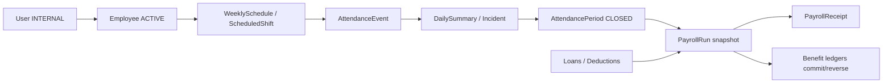

# Módulo RH — Base técnica, funcional y operativa

**Repositorio:** `C:\restaurant`
**Corte de consolidación:** 2026-07-14
**Estado:** núcleo F1–F6 implementado y validado localmente; no habilitado para producción.
**Plan vivo:** `docs/PLAN_IMPLEMENTACION_MODULO_RH.md`.

## 1. Propósito y alcance real

Este documento es la fuente de referencia para revisar, mantener, probar y desplegar el módulo de Recursos Humanos. Describe lo que existe en código, sus fronteras de seguridad, estados, integraciones y gates pendientes. No sustituye una validación legal, contable, biométrica o de protección de datos.

El flujo nuclear implementado es:



No están completos: reclutamiento, onboarding/offboarding formal, desempeño, capacitación, seguridad ocupacional, activos/uniformes, disciplina, terminación con liquidación final, API/UI dedicada de contratos/compensaciones/documentos, repositorio seguro de evidencias y reportería RH avanzada.

## 2. Principios que no se deben romper

1. `companyId` procede exclusivamente de la sesión; ningún DTO RH puede elegir tenant.
2. Owner es el `SUPERADMIN` primario verificado en base de datos. Los permisos `hr.*` permiten delegación acotada, pero no eliminan el scope tenant/sucursal.
3. Un `User INTERNAL` participa en operaciones laborales sólo cuando está `ACTIVE`, ligado uno-a-uno a un `Employee ACTIVE`. Un `EXTERNAL` no puede tener horario, biometría, marcaje, autoservicio laboral, nómina ni prestaciones.
4. Roles de aplicación, puesto laboral, contrato y compensación son conceptos separados.
5. Horarios publicados, eventos de asistencia, ledgers, snapshots, trazas y revisiones financieras no se reescriben ni eliminan; se versionan o compensan.
6. Toda mutación financiera o sensible usa idempotencia durable, revisión optimista/CAS cuando aplica, transacción y auditoría en el mismo `TransactionClient`.
7. Montos autoritativos usan `Prisma.Decimal`; el navegador no calcula nómina, aguinaldo, saldos ni conciliaciones legales.
8. El reloj del servidor y la zona IANA de la sucursal son autoritativos. La fecha/hora del dispositivo es evidencia auxiliar.
9. La biometría falla cerrada: no se persiste foto cruda y no se confía en decisiones faciales del cliente.
10. Una corrida productiva queda bloqueada hasta tener configuración legal versionada, evidencia, revisión independiente y validación operativa firmada.

## 3. Arquitectura e integración

### Backend

- Express + TypeScript.
- Prisma 5 + MySQL.
- Rutas bajo `/api/v1/hr`.
- Servicios separados por fundación, horarios, asistencia/biometría, workforce, nómina y prestaciones.
- `allowHrBodyFields` evita mass assignment.
- `requirePermission` aplica capacidades; cada controlador/servicio vuelve a comprobar tenant, branch y estado.
- `AuditLogService` participa en la transacción de la operación.
- Respuestas financieras incluyen `Cache-Control: no-store, private, max-age=0`.

### Frontend

- React 18 + TypeScript + Vite.
- Lazy loading por vista.
- `RoleGuard` para Owner y `InternalEmployeeGuard` para autoservicio laboral.
- Reutiliza `PageHeader`, `Sidebar`, `Button`, Toast, Confirm, loaders, estados vacíos y tokens CSS.
- Mutaciones financieras y de asistencia son online-only; no se encolan en `localStorage`, `sessionStorage` o IndexedDB.
- Cámara, imagen y GPS permanecen en memoria durante la operación.

## 4. Identidad, roles y expediente

### Invariante User/Employee

| Cuenta | Employee | Horario/marcaje | Nómina/prestaciones |
|---|---:|---:|---:|
| `EXTERNAL` | prohibido | prohibido | prohibido |
| `INTERNAL` + empleado no activo | histórico solamente | prohibido | prohibido |
| `INTERNAL` + `Employee ACTIVE` | obligatorio y único | permitido según permisos/política | permitido según elegibilidad |

- La conversión `EXTERNAL -> INTERNAL` ocurre al crear el expediente y actualizar al usuario dentro de una transacción.
- La baja conserva el expediente, termina adscripciones/contratos abiertos, desactiva usuario y revoca sesiones.
- Volver a `EXTERNAL` o recontratar requiere un flujo explícito; no se borra historia.
- Crear/editar empleado devuelve una proyección no sensible. PII sólo sale por el detalle protegido con `hr.employee.sensitive.view`.

### RBAC endurecido

- Un ADMIN no puede delegar permisos que no posee.
- Un ADMIN no puede autoeditar identidad o privilegios de un rol asignado a sí mismo.
- `SUPERADMIN` se determina desde el rol primario real, no desde parámetros del cliente.
- Crear una sucursal RH exige alcance company-wide Owner, aunque el actor tenga `hr.geofence.manage`.

### Entidades de fundación

- `Department`, `JobPosition`, `CostCenter`.
- `Employee`, `EmployeeBranchAssignment`.
- `EmploymentContract`, `EmployeeCompensation`, `EmployeeDocument`.
- `BranchGeofenceVersion`.

Los modelos de contratos, compensaciones y documentos existen, pero su administración especializada completa sigue en backlog.

## 5. Sucursales, geocerca y tiempo

Una sucursal puede activar asistencia sólo con:

- latitud `[-90, 90]`;
- longitud `[-180, 180]`;
- radio positivo dentro del límite admitido;
- precisión GPS máxima admitida;
- timezone IANA válida;
- estado `ACTIVE`.

Cada cambio crea `BranchGeofenceVersion`. El marcaje congela coordenadas, radio, precisión y timezone usados, por lo que mover la sucursal después no reinterpreta evidencia histórica.

La distancia usa Haversine. La aceptación exige simultáneamente distancia dentro del radio, precisión suficiente, evidencia reciente y sucursal esperada. GPS es una señal de riesgo, no una garantía absoluta de presencia.

Para DST:

- una hora local inexistente se rechaza;
- una hora repetida usa política explícita `earlier/later`;
- el instante UTC y el timezone snapshot se persisten.

## 6. Horarios semanales

### Entidades y estados

- `ShiftTemplate`.
- `WeeklySchedule`: `DRAFT -> PUBLISHED -> SUPERSEDED`; `DRAFT/PUBLISHED -> CANCELLED`.
- `ScheduledShift`.
- `ScheduleAcknowledgement`.
- `HolidayCalendar`, `Holiday`.
- `ShiftSwapRequest`, `ShiftSwapReservation`, `ShiftAssignmentOverride`.

### Invariantes

- La semana inicia lunes y una versión publicada es inmutable.
- Sólo una publicación efectiva puede existir por empresa/semana.
- Se admiten turnos partidos y nocturnos; se rechazan solapes del asignado efectivo.
- Publicación company-wide usa transacción `Serializable`, CAS y reintento acotado de conflictos Prisma.
- Antes de publicar se revalidan dentro de la transacción: `User ACTIVE`, `INTERNAL`, `Employee ACTIVE` y autorización vigente para cada sucursal.
- Un intercambio nunca reescribe el turno: crea `ShiftAssignmentOverride`.
- Crear, responder y aprobar un intercambio revalida elegibilidad; cancelar/superseder libera reservas abiertas.

### UI

- Owner: `/rh/horarios`.
- Empleado interno: `/rh/mi-portal/horario`.

## 7. Biometría y marcaje

### Persistencia

- `AttendancePolicy` versionada.
- `BiometricProfile`, `BiometricChallenge`, `BiometricVerification`.
- `AttendanceDevice` para kiosco.
- `AttendanceEvent` append-only y `AttendanceReview`.
- Outbox/estado de purga para revocación remota.

### Privacidad y proveedor

- Multipart en memoria, JPEG/PNG, máximo 2 MiB.
- La captura se descarta al terminar la petición.
- La referencia de plantilla se cifra con AES-256-GCM y `HR_BIOMETRIC_ENCRYPTION_KEY`.
- La API nunca devuelve plantilla cifrada, nonce, token hash, secreto de kiosco ni foto.
- `HR_FACE_PROVIDER=disabled` es el default fail-closed.
- `fake` requiere opt-in y se rechaza en producción.
- Sólo comparación 1:1; no hay identificación masiva 1:N.

### Resolución del marcaje

1. Revalidar usuario interno y empleado activo.
2. Tomar hora de servidor.
3. Resolver turno publicado/asignado efectivo, incluidos turnos nocturnos y múltiples turnos.
4. Resolver sucursal, geocerca versionada y política vigente.
5. Consumir challenge de un solo uso ligado a request hash e idempotency key.
6. Validar secuencia, ventanas, GPS, precisión, dispositivo y biometría/liveness.
7. Persistir el intento y su decisión explicable.

Secuencia válida:

`CHECK_IN -> (BREAK_START -> BREAK_END)* -> CHECK_OUT`

Un proveedor caído genera evidencia `REVIEW` y error 503; no crea asistencia aceptada. El fallback manual crea un evento compensatorio con motivo y actor.

El modo kiosco queda detrás de `HR_ATTENDANCE_KIOSK_ENABLED=false` hasta implementar/validar el cliente físico completo.

## 8. Jornada, incidencias, extras, permisos y vacaciones

### Resumen diario

`AttendanceDailySummary` se deriva de eventos efectivos; calcula minutos ordinarios, descansos, tardanza, salida temprana y extra candidata. Los descansos no pagados se excluyen de intervalos trabajados.

- Un turno nocturno se atribuye a su fecha local de inicio.
- Permisos `FULL_DAY`, `HALF_DAY` y `HOURS` se convierten en intervalos reales contra el turno.
- `HALF_DAY` exige exactamente 240 minutos, coherente con el ledger.
- Un permiso parcial no oculta la parte del turno sin marcaje.
- Un solo `CHECK_IN`/`CHECK_OUT` dentro de un permiso completo crea conflicto `CRITICAL`.
- `sourceRevision` sólo cambia si cambia la fuente semántica.

### Incidencias y correcciones

- Las incidencias tienen clave deduplicada y severidad `INFO/WARNING/CRITICAL`.
- Un período no cierra con incidencias críticas, correcciones/extras/permisos pendientes o fuentes incompatibles.
- Una corrección nunca edita `AttendanceEvent`; crea un evento canónico compensatorio.
- La rama, usuario, timezone y fecha destino se resuelven del evento/resumen autoritativo, no del body.

### Períodos

- `AttendancePeriod`: `OPEN -> CLOSED -> OPEN` mediante reapertura auditada.
- Un período cerrado congela resúmenes y es elegible para nómina sólo si pasa validaciones.
- Una dependencia de nómina viva bloquea la reapertura; no se puede cambiar silenciosamente una fuente congelada.

### Extras

- `OvertimeRequest`: candidato/solicitud -> `APPROVED/REJECTED/CANCELLED`.
- La aprobación valida el `sourceRevision` del resumen.
- Sólo minutos aprobados alimentan nómina.

### Permisos y vacaciones

- `LeaveType`, `LeaveRequest`, `VacationBalance`, `VacationLedgerEntry`.
- Flujo `DRAFT -> PENDING -> APPROVED/REJECTED/CANCELLED`.
- No se permite autoaprobación.
- Submit/approve revalidan empleado, solapes, período abierto, evidencia y saldo.
- La cancelación de un permiso aprobado crea reversión en ledger.
- Si un tipo exige adjunto, el sistema falla cerrado hasta existir repositorio seguro de evidencia.

## 9. Nómina y aguinaldo

### Configuración legal

`PayrollRuleVersion` mantiene vigencia y metadatos. La configuración técnica vive en `PayrollRuleConfigurationRevision`, se hashea y no se devuelve como JSON en listados. Otro actor registra `PayrollRuleConfigurationReview` con `VALIDATED` o `REJECTED`.

El esquema aceptado es `HR_PAYROLL_PARAMETRIC_V1` e incluye:

- moneda ISO;
- divisores por frecuencia `WEEKLY/BIWEEKLY/MONTHLY`;
- multiplicador de extra;
- conversión de unidades de permiso;
- FX por moneda con tasa, versión y fuente;
- método de aguinaldo histórico, lookback, divisor, prorrateo y fuentes elegibles.

No hay tasas legales hardcodeadas. Las revisiones de configuración son append-only y sus metadatos quedan congelados al validarse; una modificación material exige crear una nueva versión `DRAFT`, cargar otra revisión y obtener un nuevo dictamen independiente.

### Corrida regular

Estados:

`DRAFT -> CALCULATED -> REVIEW -> APPROVED -> PAID -> VOID`

- `HOURLY` interpreta compensación como importe por hora.
- `SALARY` usa el divisor versionado de su frecuencia.
- Contrato, compensación, ingreso/baja, asistencia cerrada, extras y permisos se segmentan por vigencia.
- `PayrollSnapshotLine` y `PayrollAttendanceDependency` congelan fuentes/revisiones.
- `PayrollCoverageClaim` impide pagar dos veces a la misma persona por un rango superpuesto; `VOID` libera mediante `PayrollCoverageRelease` trazable.
- Componentes manuales sólo se agregan en `CALCULATED`, para una persona existente en el snapshot y antes de revisión. La UI y el servicio comparten ese estado y reutilizan una misma clave idempotente ante un resultado de red ambiguo.
- Anomalías `BLOCKING` impiden review/approve/pay.

### Aguinaldo

- Usa componentes históricos elegibles de corridas regulares `PAID` y recibos `PUBLISHED`.
- El lookback, divisor y prorrateo por días de servicio proceden de la configuración congelada.
- `PayrollAguinaldoSourceDependency` congela por revisión la corrida, componente, recibo, importe, moneda, estados y situación de reversión de cada fuente.
- Las dependencias son append-only y se revalidan antes de revisar, aprobar o pagar. Una corrida regular que alimenta un aguinaldo vigente no puede anularse hasta anular primero el aguinaldo dependiente.

### Segregación y pago

- Quien prepara/calcula o envía a revisión no puede aprobar.
- Quien calcula/revisa/aprueba no puede marcar pagada.
- `pay` exige referencia, fecha, método, evidencia y lote opcional.
- `PAID -> VOID` exige un actor distinto de quien aprobó y pagó, más evidencia, referencia, fecha y método de reversión externa. Dentro de la misma transacción se registra primero el asiento compensatorio y después se revierten deducciones comprometidas y recibos.
- La UI conserva la misma `Idempotency-Key` durante reintentos ambiguos de cualquier transición y sólo la descarta al confirmar éxito o cancelar explícitamente.
- Recibos de autoservicio son `PUBLISHED` del usuario autenticado y omiten trazas internas/otros empleados.

### Integración con prestaciones

1. `projectBenefitDeductions` agrega componentes sólo a nómina regular.
2. Una moneda distinta sin FX no se omite: produce anomalía `BLOCKING` deduplicada.
3. `commitBenefitDeductions` aplica cuota/deducción al pagar.
4. `reverseBenefitDeductions` crea contramovimientos al anular una corrida pagada.

## 10. Viáticos, préstamos y deducciones

### Viáticos

Estado principal:

`DRAFT -> SUBMITTED -> APPROVED -> ADVANCED -> IN_SETTLEMENT -> SETTLED`

También existen rechazo, cancelación y reversión. La liquidación reconcilia anticipo, gastos reconocidos, devolución del empleado o reembolso de la empresa. Registrar anticipo y cerrar liquidación requieren actores distintos. Las referencias de anticipo/liquidación/reversión son obligatorias.

Los gastos usan una misma idempotency key por operación lógica en UI; un timeout ambiguo no crea un segundo gasto.

### Préstamos

- Solicitud, aprobación, calendario, desembolso, pago/deducción, cierre, cancelación y reversión.
- El calendario es principal-only; no se inventan interés, cargos o tasas.
- Saldo derivado de `HrLoanLedgerEntry`.
- Calendarios/versiones/ledgers son inmutables.

### Deducciones

- Manuales o ligadas a préstamo.
- Únicas o recurrentes.
- Prioridad, vigencia, límite por período, moneda, versión y estado.
- `HrDeductionApplication` impide doble aplicación en reintentos.

### Evidencias

Los campos `evidenceId` fallan cerrados con `HR_BENEFITS_EVIDENCE_REPOSITORY_REQUIRED` hasta implementar un repositorio privado verificable. No sustituirlo con una URL pública o un identificador no scoped.

## 11. Matriz de permisos

| Familia | Lectura Owner | Gestión Owner | Aprobación | Autoservicio |
|---|---|---|---|---|
| Empleado | `hr.employee.read` | `hr.employee.manage` | — | — |
| PII expediente | `hr.employee.sensitive.view` | — | — | — |
| Catálogos | `hr.catalog.read` | `hr.catalog.manage` | — | — |
| Geocerca | `hr.geofence.read` | `hr.geofence.manage` + company-wide para alta | — | — |
| Horarios | `hr.schedule.read` | `hr.schedule.manage` | `hr.schedule.publish` | `hr.schedule.self` |
| Asistencia | — | `hr.attendance.manage` | `hr.attendance.review` | `hr.attendance.self` |
| Biometría | — | `hr.biometric.manage` | — | `hr.biometric.self` |
| Workforce | `hr.workforce.read` | `hr.workforce.manage` | `hr.workforce.approve` | `hr.workforce.self` |
| Nómina | `hr.payroll.read` | `hr.payroll.manage` | `hr.payroll.approve` | `hr.payroll.self` |
| Prestaciones | `hr.benefits.read` | `hr.benefits.manage` | `hr.benefits.approve` | `hr.benefits.self` |

Tener un permiso no autoriza otro tenant, otra sucursal o autoaprobación.

## 12. Contrato API por dominio

Base: `/api/v1/hr`.

### Fundación

- `/dashboard`, `/lookups`.
- `/employees`, `/employees/:id`, `/employees/:id/status`.
- `/departments`, `/positions`, `/cost-centers`.
- `/branches`, `/branches/:id/geofence`.

### Horarios

- `/shift-templates`.
- `/schedules`, `/:id/copy|publish|cancel|acknowledge`.
- `/me/schedule`.
- `/swaps`, `/me/swaps`, `/:id/respond|approve|cancel|manager-cancel`.
- `/holiday-calendars`, `/holidays`.

### Asistencia/biometría

- `/attendance/policy`, `/me/attendance/today`.
- `/biometrics/challenges`, `/biometrics/me`, `/biometrics/enroll`.
- `/attendance/punches`, `/attendance/events`, `/:id/review`, `/attendance/manual`.
- `/attendance/devices`, `/:id/revoke`.

### Workforce

- `/attendance/daily-summaries|incidents|corrections|periods`.
- `/overtime/requests`.
- `/leave/types|requests|calendar`.
- `/vacation/balances|ledger|adjustments`.
- `/me/attendance/summary`, `/me/workforce`.

### Nómina

- `/payroll/rules` y `/:id/configuration-revisions|configuration-reviews|activate|retire`.
- `/payroll/periods`.
- `/payroll/runs` y `/payroll/aguinaldo/runs`.
- Corrida `/:id/calculate|recalculate|submit-review|approve|pay|void`.
- Corrida `/:id/anomalies|snapshot|components|receipts|export`.
- `/payroll/me/receipts` y PDF propio.

### Prestaciones

- `/benefits/travel-requests`, gastos y transiciones.
- `/benefits/loan-requests`, `/benefits/loans` y transiciones.
- `/benefits/deductions` y transiciones.
- variantes `/benefits/me/*` scoped al usuario.

## 13. Rutas de interfaz

Owner:

- `/rh`, `/rh/personal`, `/rh/personal/:employeeId`.
- `/rh/horarios`.
- `/rh/asistencia`, `/rh/asistencia/configuracion`.
- `/rh/jornadas`, `/rh/ausencias`.
- `/rh/nomina`, `/rh/prestaciones`.

Empleado interno:

- `/rh/mi-portal`.
- `/rh/mi-portal/horario`, `/rh/marcaje`, `/rh/biometria`.
- `/rh/mi-portal/gestion`, `/rh/mi-portal/nomina`, `/rh/mi-portal/prestaciones`.

Usuarios externos son redirigidos fuera de todas las rutas laborales por `InternalEmployeeGuard`.

## 14. Migraciones y orden de despliegue

Orden obligatorio:

1. `20260713_add_hr_foundation`.
2. `20260713_add_hr_weekly_scheduling`.
3. `20260713_hr_03_attendance_biometrics`.
4. `20260713_hr_04_workforce_management`.
5. `20260713_hr_05_payroll_aguinaldo`.
6. `20260713_hr_06_benefits_loans_deductions`.

Cada carpeta contiene `migration.sql` y `rollback.sql`. Los rollbacks eliminan datos RH y son sólo una herramienta de emergencia: exportar evidencia y verificar dependencias antes de usarlos.

No se aplicaron estas migraciones en producción ni en una base clon durante esta implementación. El baseline fue actualizado estáticamente, pero no sustituye el ensayo MySQL.

Procedimiento mínimo:

1. Backup lógico verificado.
2. Restaurar en clon aislado.
3. Aplicar migraciones en orden.
4. Verificar constraints, triggers append-only, índices y backfill.
5. Ejecutar pruebas de integración contra el clon.
6. Ensayar rollback o forward-fix documentado.
7. Desplegar servidor antes que navegación cliente.
8. Smoke por tenant/sucursal y activación gradual.

## 15. Variables y operación

```env
HR_FACE_PROVIDER=disabled
HR_ALLOW_FAKE_FACE_PROVIDER=false
HR_ATTENDANCE_KIOSK_ENABLED=false
HR_BIOMETRIC_ENCRYPTION_KEY=
```

- La clave biométrica debe ser hexadecimal de 64 caracteres cuando el proveedor está habilitado.
- Debe vivir en secret manager, con backup, rotación y acceso limitado.
- Una rotación requiere estrategia de re-cifrado/re-enrolamiento; no reemplazar la clave sin plan.
- El scheduler de retención/purga debe ejecutarse en una sola instancia lógica o con lock distribuido.

## 16. Evidencia de validación local

Gate consolidado final del 2026-07-14:

- Prisma `format`, `generate` y `validate`: aprobados.
- Typecheck servidor y cliente: aprobados.
- Suite servidor: 85 suites, 469 pruebas aprobadas después del hardening financiero final.
- Suite cliente: 38 archivos, 140 pruebas aprobadas después de integrar configuración legal, pago, reversión, estados E2E e idempotencia estable.
- Build cliente: aprobado; warning no bloqueante por chunk grande de `react-pdf`.
- F4 focal: 50/50.
- F5 focal final: 22/22; focal conjunta previa F4/F5/F6: 48/48.
- F6 focal con moneda: 13/13.
- Dos reauditorías independientes y read-only cerraron con cero hallazgos P0/P1 residuales.
- No se ejecutaron migraciones, integración MySQL ni Playwright con cámara/GPS reales.

## 17. Gates pendientes antes de producción

1. Migración y rollback sobre clon MySQL restaurado.
2. Pruebas de integración con constraints/triggers reales.
3. Validación firmada de reglas legales, fiscales, contables y política de redondeo.
4. Proveedor facial productivo, credenciales, evaluación de sesgo/precisión, privacidad y piloto.
5. Repositorio privado de evidencias con ownership, antivirus, cifrado, retención y descarga autorizada.
6. Piloto de nómina no productiva con reconciliación por persona y total.
7. Playwright/HTTPS con permisos de cámara y geolocalización; responsive, teclado y lector de pantalla.
8. Cliente kiosco real si se habilitará ese canal.
9. Parámetros legales de devengo/expiración/pago de vacaciones.
10. Intereses/cargos de préstamos sólo después de política validada; hoy es principal-only.
11. Segregación operativa cuando exista un solo Owner; el sistema falla cerrado, pero la organización necesita actores distintos.
12. Monitoreo y alertas sin PII/biometría/salarios en logs.

## 18. Checklist para futuras revisiones

### Seguridad

- [ ] Ningún DTO acepta `companyId`, actor, decisión facial o totales autoritativos.
- [ ] Todas las lecturas/mutaciones filtran tenant y branch.
- [ ] Externos y empleados no activos quedan fuera de workflows laborales.
- [ ] ADMIN no puede escalar permisos ni autoeditar sus roles.
- [ ] PII requiere `hr.employee.sensitive.view`.
- [ ] No se filtran plantillas, imágenes, hashes, secretos o trazas financieras internas.

### Dominio

- [ ] Publicación revalida elegibilidad y sucursal dentro de la transacción.
- [ ] Correcciones y reversión crean contramovimientos.
- [ ] Período cerrado no cambia mientras una nómina viva dependa de él.
- [ ] Config legal modificada exige nuevo dictamen independiente.
- [ ] Aguinaldo revalida corridas/componentes/recibos históricos.
- [ ] Pago y anulación pagada tienen evidencia externa y actores separados.
- [ ] Deducciones multimoneda bloquean si no existe FX versionado.

### UX/UI

- [ ] Acciones visibles reflejan `allowedActions` del servidor.
- [ ] Toda acción irreversible muestra motivo, confirmación y datos de evidencia.
- [ ] Reintentos ambiguos reutilizan la misma idempotency key.
- [ ] Estados loading/error/empty/offline no exponen datos previos.
- [ ] Owner y empleado conservan navegación, tokens, responsive y accesibilidad del producto.

### Operación

- [ ] Backup/restauración y rollback ensayados.
- [ ] Feature flags permanecen cerrados hasta completar su gate.
- [ ] Secretos y claves están fuera del repositorio.
- [ ] Métricas no contienen PII, biometría ni salarios.
- [ ] Piloto y reconciliación quedan firmados antes del go-live.

## 19. Regla de mantenimiento documental

Todo cambio RH debe actualizar simultáneamente:

1. el checklist del plan maestro;
2. esta base técnica si cambia un contrato, estado o invariante;
3. migración/rollback cuando cambia persistencia;
4. pruebas que demuestren el caso normal, el reintento y el abuso;
5. gates residuales si la capacidad sigue cerrada operacionalmente.

No marcar una capacidad como productiva por tener sólo UI, sólo API o pruebas con mocks.
